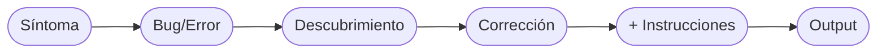

# Notes

## Clipboards options

- CopyQ
- Clipit
- Clipman
- GPaste
- xclip

https://github.com/matricci/oh-my-zsh-termux
https://gist.github.com/rahaaatul/cc47d88dddd73a684e67bfa0f8b57d9d

## 05-10-2026, Sunday

### Command line markdown viewers

- https://github.com/guilhermeprokisch/see ✅
- https://codeberg.org/johann1764/smd ✅
- https://github.com/visit1985/mdp ✅
- https://github.com/charrismatic/mandown ❌
- https://github.com/textualize/frogmouth ✅
- https://github.com/avilum/busymd ✅
- https://github.com/Inlyne-Project/inlyne ✅
- https://github.com/mvz/mdv ✅
- https://github.com/mrchimp/mdr ✅
- https://github.com/tj/mad ⛔️

### Pass git helper
https://github.com/languitar/pass-git-helper

## 23-02-2025, Sunday
- entry
## 15-02-2025, Saturday
- entry
## 09-02-2025, Sunday
- entry

---
# January 2025
## 21-01-2025, Tuesday
- entry
## 12-01-2025, Sunday
- Terminar el archivo Dconf para importar y exportar perfiles Gnome
## 11-01-2025, Saturday
- https://wiki.archlinux.org/title/XDG_user_directories
- https://www.freecodecamp.org/news/linux-chmod-chown-change-file-permissions/
- https://www.howtogeek.com/439500/how-to-use-the-chgrp-command-on-linux/
- https://linuxize.com/post/chgrp-command-in-linux/
- https://www.geeksforgeeks.org/chgrp-command-in-linux-with-examples/
- https://www.liberiangeek.net/2024/02/how-to-update-kernel-on-debian-12/
- https://www.tecmint.com/kernel-compilation-in-debian-linux/#google_vignette
- https://www.kingopsec.com/en/content/debian/faq/como-atualizar-o-kernel-no-debian-12-ou-lmde6
- https://davidzchen.com/tech/2020/07/21/importing-and-exporting-gnome-terminal-color-schemes.html
- https://www.ubuntumint.com/export-import-gnome-terminal-profile/
- https://gist.github.com/fdaciuk/9ec4d8afc32063a6f74a21f8308e3807
- https://unix.stackexchange.com/questions/448811/how-to-export-a-gnome-terminal-profile#456356
- https://commandmasters.com/commands/xdg-settings-linux/
- https://www.reddit.com/r/unixporn/
- https://gitlab.com/parrotsec/project/debian-conversion-script
- https://www.qubes-os.org/downloads/
- https://www.whonix.org/
## 05-01-2025, Sunday
- https://superuser.com/questions/59418/how-to-type-special-characters-in-linux
- https://askubuntu.com/questions/1407203/i-dont-have-the-and-symbols-on-my-keyboard-how-to-assign-a-shortcut-to
## 04-01-2025, Saturday
- Installed programs
	- snap
	- librewolf
	- microsoft edge
	- obsidian
	- notion
	- appyflowy
	- inkscape
	- nordpass
	- flathub / flapak
	- nvm
	- node
	- ffmpeg
	- python3-pip
	- vim-gtk3
	- make
	- cmake
	- cmatrix
	- build-essential
	- breeze-cursor
	- volantes cursor
	- bibata-cursor
	- git
	- inkscape
## 29-12-2024, Sunday
- Links
	- [Pop_OS Guide](https://pop-os.github.io/docs/getting-started/getting-started.html)
	- [Managing repositories in Pop_OS](https://support.system76.com/articles/manage-repos-pop/)
	- [Uninstalling applications on Pop_OS](https://github.com/philmirez/uninstalling-applications-on-pop_os/tree/master)
	- [How to solve this Dependencies apt --fix-broken install](https://superuser.com/questions/1386209/how-to-solve-this-dependencies-apt-fix-broken-install)
	- [Pop_OS Setup Guide](https://flamedfury.com/posts/pop_os-setup-guide/)
	- [Pop_OS Customization](https://support.system76.com/articles/customize-gnome/)
	- [Linux: Configure and use your TPM 2.0 module on Linux](https://paolozaino.wordpress.com/2021/02/21/linux-configure-and-use-your-tpm-2-0-module-on-linux/)
	- [How to change root password](https://www.cyberciti.biz/faq/change-root-password-ubuntu-linux/#google_vignette)
	- [Kernel hardening: Disable and blacklist Linux modules](https://linux-audit.com/kernel/kernel-hardening-disable-and-blacklist-linux-modules/)
	- [The Complete Guide to Changing Desktop Environments on Debian](https://thelinuxcode.com/change-debian-desktop-environment/)
	- [TUTORIAL: how to make a clean KDE Plasma install on Debian 12 with the environment package of your choosing (minimal, standard or full)](https://www.reddit.com/r/debian/comments/1640aaq/tutorial_how_to_make_a_clean_kde_plasma_install/)
	- [Disable feedback when typing password at a sudo prompt](https://superuser.com/questions/1404382/disable-feedback-when-typing-password-at-a-sudo-prompt)
	- [Disable feedback what typing password at a sudo prompt 2](https://medium.com/@jimmashuke/how-to-stop-that-annoying-sudo-password-prompt-in-linux-b2b72b9c2f55)
	- [Enable feedback when typing password at a sudo prompt 1](https://superuser.com/questions/420815/feedback-when-typing-password-at-a-sudo-prompt)
	- [How to Make Password Asterisks Visible in the Terminal Window in Linux](https://www.howtogeek.com/194010/how-to-make-password-asterisks-visible-in-the-terminal-window-in-linux/)
	- [Example of enable or disable tty login prompt to give or not feedback as I type my password](https://superuser.com/questions/1025099/show-password-characters-when-logging-in-to-linux)
	- [How to install and edit desktop files on Linux (Desktop entries)](https://www.cyberciti.biz/howto/how-to-install-and-edit-desktop-files-on-linux-desktop-entries/)
	- [Running a .desktop file in the terminal](https://askubuntu.com/questions/5172/running-a-desktop-file-in-the-terminal)
	- [Using WPA_Supplicant to Connect to WPA2 Wi-fi from Terminal on Ubuntu 16.04 Server](https://www.linuxbabe.com/command-line/ubuntu-server-16-04-wifi-wpa-supplicant)
	- [Connect to Wi-Fi From Terminal on Debian 11/10 with WPA Supplicant](https://www.linuxbabe.com/debian/connect-to-wi-fi-from-terminal-on-debian-wpa-supplicant)
	- [Connect to Wi-Fi From Terminal on Ubuntu 22.04/20.04 with WPA Supplicant](https://www.linuxbabe.com/ubuntu/connect-to-wi-fi-from-terminal-on-ubuntu-18-04-19-04-with-wpa-supplicant)
	- [How to Use Timeshift from Command Line in Linux](https://dev.to/rahedmir/how-to-use-timeshift-from-command-line-in-linux-1l9b)
## 27-12-2024, Friday
- https://www.madpenguin.org/how-to-set-default-browser-in-linux/
- https://linuxconfig.org/how-to-set-browser-environment-variable-on-linux
- https://vitux.com/how-to-set-the-default-browser-on-debian-trough-the-command-line/
- https://wiki.debian.org/DefaultWebBrowser
- https://thelinuxcode.com/open-default-browser-command-line-linux/
- https://askubuntu.com/questions/16621/how-to-set-the-default-browser-from-the-command-line
- https://askubuntu.com/questions/8252/how-to-launch-default-web-browser-from-the-terminal
## 25-12-2024, Wednesday
- Clone the repo via `git clone https://github.com/alfredprof3/Linux.git`
- After cloning the repo, `cd Linux`  to get inside the directory
- Check and be sure you are working in the remote branch with `git remote -v` or `git remote show origin`
- Store the credentials with `credential.helper store` typing the command `git config --local credential.helper store`
- Manually push the changes with `git push` for the first time to setup the `git credential.helper` to store the credentials locally in $HOME
- Place the your user name and the github token (only for this commit)
- Download the Obsidian plugin `Github Sync` and enable the plugin placing the remote URL
- Do some stuff and press the ribbon icon of `Github Sync` to push the changes

Notes about Prompting-Troubleshooting
-----

#type/Use-Case-Study #topic/Gemini-AI/Prompting-Troubleshooting #for/AI 
# Manual de Interacción con IA: Prompting y Troubleshooting

## 1. Arquitecturas de Prompts (Plantillas)

### Fase de Creación (El Inicio)
* **Rol:** Actúa como Rol específico, [ej. Administrador de Sistemas Linux Senior.]
* **Objetivo:** Escribe/Crea (Entregable).
* **Contexto:** Por qué lo necesitas y cómo se usará.
* **Formato de Salida:** Output, dile a la IA como debe estructurar su respuesta.
* **Restricciones:** Qué NO debe hacer, formato de salida, compatibilidad.

### Fase de Refinamiento (Iteración)
* **Ancla:** Sobre el [elemento específico] que acabas de generar...
* **Acción/Problema:** Necesito que [agregues/modifiques/elimines] esto.
* **Contexto/El Porqué:** El objetivo de este cambio es [razón].
* **Control de Salida:** Imprime únicamente los snippets modificados y dime en qué línea insertarlos. No devuelvas todo el código.
* **Restricciones:** Qué NO debe hacer, formato de salida, compatibilidad.

### Fase de Depuración (Debugging/Troubleshooting)
* **Síntoma/Contexto:** Al ejecutar [acción], sucede [comportamiento actual] en lugar de [comportamiento esperado].
* **El Error/Bug:** Describe qué falló. Si la terminal muestra un eror, pega textualmente: [Pegar log].
* **Descubrimiento:** Revisando el código, noté que [tu lógica o descubrimiento].
* **Acción Correctiva:** Corrige este flujo. Imprime solo el snippet corregido.
* **Nevas Instrucciones (Opcional):** En caso de contar con nuevas instrucciones, añadirlas. No es obligatorio ni necesario.
* **Output:** Para que no vuelva a escribir todo desde cero y sobre todo en programación, se le indica que imprima los cambios.

### Reporte de Falla (Failed Fix)
* **Estado:** Apliqué los cambios, pero el problema persiste. [Describir síntoma exacto, ej. archivo de 0 bytes].
* **Contexto de Ejecución:** Estoy usando [SO, terminal, comandos exactos].
* **Petición de Rastreo:** Indícame cómo habilitar el modo de depuración (`set -x`) para ver dónde falla, o corrige el error lógico.

### Conversaciones Pausadas
Si regresas a una conversación después de unas horas o días, la IA puede perder «frescura» en el contexto. Ábrele el mensaje con un recordatorio rápido para realinearla, ej. «_Retomemos el script de tareas. En la versión actual ya configuramos la creación y el borrado. Ahora quiero que nos enfoquemos..._»

---

## 2. Glosario Técnico (Inglés a Español)
* **Context-switching:** Pérdida de foco y tiempo al cambiar entre diferentes aplicaciones o ventanas (ej. salir de la terminal para abrir una app de notas).
* **Verbose logging / Debug mode:** Modo de ejecución que imprime cada paso que da un programa antes de ejecutarlo. En Bash se activa con `set -x`.
* **Silent failure:** Cuando un programa o script falla pero no arroja ningún mensaje de error en la pantalla.
* **Payload extraction:** El proceso de descomprimir o sacar el código fuente original que está escondido dentro de un instalador.
* **Refactoring:** Reestructurar el código fuente para mejorarlo (hacerlo más limpio o eficiente) sin cambiar su comportamiento final.
* **Code snippets:** Fragmentos pequeños de código.

---

## 3. Casos de Estudio (Historial de Errores)
* **Problema:** Instalador de un solo archivo en Bash generaba un archivo vacío (0 bytes) en macOS. Era una falla silenciosa.
* **Diagnóstico:** Al activar `set -ex`, el rastreo mostró `base64: invalid argument`.
* **Causa Raíz:** Diferencias entre entornos UNIX. macOS usa utilidades BSD (que requieren la bandera `-i` en `base64`), mientras que Linux usa GNU. Además, el script constructor fallaba si el archivo fuente (payload) no estaba en el mismo directorio.

/home/xuser/.local/bin/syncline-git-credential get: 1: /home/xuser/.local/bin/syncline-git-credential: not found
Username for 'https://github.com': alfredprof3
Password for 'https://alfredprof3@github.com':
/home/xuser/.local/bin/syncline-git-credential store: 1: /home/xuser/.local/bin/syncline-git-credential: not found
To https://github.com/alfredprof3/syncline-repo-1.git
 ! [rejected]        master -> master (fetch first)
error: falló el empuje de algunas referencias a 'https://github.com/alfredprof3/syncline-repo-1.git'
hint: Updates were rejected because the remote contains work that you do not
hint: have locally. This is usually caused by another repository pushing to
hint: the same ref. If you want to integrate the remote changes, use
hint: 'git pull' before pushing again.
hint: See the 'Note about fast-forwards' in 'git push --help' for details.
✓ Remote set and initial push complete.
